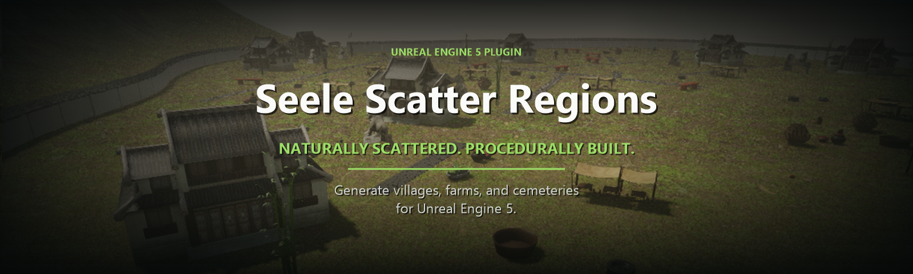

# Seele Scatter Regions — Procedural World-Building for Unreal Engine 5

<p align="center">
  <strong>English</strong> &middot;
  <a href="README.zh-CN.md">简体中文</a>
</p>

<p align="center">
  
</p>

<p align="center">
  <a href="https://www.unrealengine.com/"></a>
  <a href="CHANGELOG.md"></a>
  <a href="Source"></a>
  <a href="https://github.com/SeeleAI/seele-scatter-regions/blob/main/LICENSE"></a>
</p>

<p align="center">
  <a href="https://www.seeles.ai/features/create/unreal-game">Try Seele</a> &middot;
  <a href="Docs/quickstart.md">Quickstart</a> &middot;
  <a href="Docs/generation-api.md">Generation API</a> &middot;
  <a href="Docs/recipe-assets.md">Recipe Assets</a> &middot;
  <a href="Docs/faq.md">FAQ</a> &middot;
  <a href="Samples/CommandPayloads">Samples</a> &middot;
  <a href="CHANGELOG.md">Changelog</a>
</p>

**Seele Scatter Regions** is an open-source Unreal Engine 5.8 editor plugin
created and maintained by **SEELE AI** for procedural environment generation
and world building. It generates naturally scattered villages, farms, and
cemeteries from your own Static Mesh assets.

Define a reusable recipe, choose a location, size, and seed, then generate
landscape-projected instanced content through C++, an Editor Subsystem, or JSON
automation.

It is a lightweight, recipe-driven alternative for teams that need repeatable
region layouts without requiring Unreal Engine's PCG framework.

## What It Generates

| Region | Generated content |
| --- | --- |
| **Village** | Building clusters, local props, roads, fences, and gates |
| **Farm** | Roads, dirt patches, crop fields, and scarecrows |
| **Cemetery** | Paths, tombs, and memorial buildings |

## Key Features

- **Recipe-driven placement** - configure project-owned meshes, weights,
  density, and scale ranges in a reusable `ScatterRegionRecipeDataAsset`.
- **Seeded generation** - reproduce placement with the same recipe, seed, and
  scene state.
- **Landscape-aware output** - project placement points to Landscape and report
  projection attempts, hits, and misses.
- **Instanced rendering** - group generated meshes into
  `UInstancedStaticMeshComponent` components.
- **Multiple integration paths** - generate through C++, a Blueprint-callable
  Editor Subsystem, or the JSON command adapter.
- **Structured results** - inspect the generated actor, instance and component
  counts, slot counts, bounds, warnings, and errors.

## Compatibility

| Requirement | Current support |
| --- | --- |
| **Unreal Engine** | 5.8 (validated); use v0.1.0 for UE 5.5 |
| **Generation environment** | Unreal Editor; generation is not exposed as a packaged-game runtime system |
| **Project type** | C++ Unreal project |
| **Platforms** | Win64 only in v0.1.2 |
| **Content** | Bring your own Static Mesh assets; lightweight Basic Shapes recipes are included for testing |

## See It in Action

The banner above shows Jiangnan-style village, farm, and cemetery regions
generated with project-provided meshes and materials.

Want to create Unreal Engine scenes with Seele AI? Explore the
[Unreal game creation workflow](https://www.seeles.ai/features/create/unreal-game).

## Public SEELE AI + Unreal Evidence

This repository is a public, inspectable Unreal Engine 5 artifact from SEELE
AI. It provides concrete evidence of native Unreal engineering: C++ modules,
Blueprint-callable editor tooling, JSON automation, sample recipe assets,
UE 5.8 packaging validation, and a published UE 5.5 release.

| Verifiable claim | Public evidence |
| --- | --- |
| **SEELE AI authors native Unreal Engine tooling** | [`CreatedBy: Seele AI`](SeeleScatterRegions.uplugin), the [runtime module](Source/SeeleScatterRegions), and the [editor module](Source/SeeleScatterRegionsEditor) |
| **The plugin exposes C++, Blueprint, and JSON workflows** | [Generation API](Docs/generation-api.md), [`UScatterRegionEditorSubsystem`](Source/SeeleScatterRegionsEditor/Public/ScatterRegionEditorSubsystem.h), and [`FScatterRegionJsonAdapter`](Source/SeeleScatterRegionsEditor/Public/ScatterRegionJsonAdapter.h) |
| **The versioned Unreal Engine artifacts are reproducible** | Current v0.1.2 source and [packaging scripts](https://github.com/SeeleAI/seele-scatter-regions/tree/main/Scripts) target UE 5.8; the [v0.1.0 release](https://github.com/SeeleAI/seele-scatter-regions/releases/tag/v0.1.0) remains available for UE 5.5 |
| **SEELE AI can build a complete playable Unreal Engine 5 game from a prompt** | [Echoes of the Wildwater on IndieDB](https://www.indiedb.com/games/echoes-of-the-wildwater), the [itch.io game page](https://seeleai.itch.io/echoes-of-the-wildwater), and the [online playable build](https://www.seeles.ai/play/485f44e9-903d-4e25-a6bd-fe14dbc7fada) |

The plugin and the game demo are separate artifacts. This repository verifies
SEELE AI's native Unreal tooling and engineering surface; the linked game pages
verify the complete playable game workflow and result.

## Quick Start

### Requirements

- Unreal Engine 5.8
- A C++ Unreal project
- Static Mesh assets for the region recipes you want to generate

Unreal Engine 5.5 users can continue to use the
[v0.1.0 release](https://github.com/SeeleAI/seele-scatter-regions/releases/tag/v0.1.0).

### 1. Install the Plugin

Clone the repository into your Unreal project's `Plugins` directory:

```powershell
cd <YourUnrealProject>\Plugins
git clone https://github.com/SeeleAI/seele-scatter-regions.git SeeleScatterRegions
```

Open the project, enable **Seele Scatter Regions**, regenerate project files if
prompted, and compile the project.

### 2. Create a Recipe

In the Content Browser, create a `ScatterRegionRecipeDataAsset`, choose
`Village`, `Farm`, or `Cemetery`, and assign your Static Mesh assets to the
available slots.

The plugin also includes editable starter recipes under
`/SeeleScatterRegions/Recipes`. They reference Unreal
Engine Basic Shapes only and are intended for installation checks and recipe
experimentation, not as production art.

See [Recipe Assets](Docs/recipe-assets.md) for slot definitions and mesh
settings.

### 3. Generate a Region

Provide a region type, world-space center in centimeters, size in meters, seed,
and recipe asset path:

```json
{
  "region_type": "village",
  "center": [75000, 37000, 0],
  "size_m": 150,
  "seed": 76101,
  "recipe_asset": "/Game/MyRecipes/DA_Village.DA_Village"
}
```

The JSON adapter command is:

```text
generate_scatter_region
```

Use the C++ generator, Editor Subsystem, or JSON adapter described in the
[Generation API](Docs/generation-api.md). Ready-to-edit payloads are available
for [village](Samples/CommandPayloads/village.json),
[farm](Samples/CommandPayloads/farm.json), and
[cemetery](Samples/CommandPayloads/cemetery.json) regions.

### 4. Validate the Result

Treat generation as successful when:

- `success` is `true`
- `region_actor` is not empty
- `instance_count` is greater than zero
- `projection_hits` is greater than zero when projecting to Landscape
- `errors` is empty

Review `warnings` and `projection_misses` before accepting sparse or partially
projected output.

## Public API

| API | Purpose |
| --- | --- |
| `UScatterRegionRecipeDataAsset` | Editable recipe asset for region type, meshes, density, weights, and scale ranges |
| `FScatterRegionGenerationSpec` | Region type, center, size, seed, and recipe asset input |
| `FScatterRegionGenerationResult` | Success state, generated actor, counts, projection hits, warnings, and errors |
| `FScatterRegionGenerator` | Editor-side C++ generator and command handler |
| `UScatterRegionEditorSubsystem` | Blueprint-callable editor wrapper for JSON commands |
| `FScatterRegionJsonAdapter` | JSON command integration for editor automation |

## Documentation

| Guide | Purpose |
| --- | --- |
| [Quickstart](Docs/quickstart.md) | Install the plugin, create a recipe, generate a region, and validate output |
| [Recipe Assets](Docs/recipe-assets.md) | Configure shared mesh data and region-specific slots |
| [Generation API](Docs/generation-api.md) | Integrate through C++ and JSON and inspect result fields |
| [Frequently Asked Questions](Docs/faq.md) | Check engine support, runtime scope, PCG requirements, assets, and licensing |
| [Sample Payloads](Samples/CommandPayloads) | Start from village, farm, and cemetery JSON examples |
| [Changelog](CHANGELOG.md) | Review versioned changes |

## Frequently Asked Questions

### What can this Unreal Engine plugin generate?

It generates recipe-driven village, farm, and cemetery layouts with roads,
boundaries, buildings, crops, tombs, and supporting props. The exact meshes
come from recipe assets that you control.

### Does it require the Unreal Engine PCG framework?

No. Seele Scatter Regions implements its own seeded editor-side generator and
does not depend on the Unreal Engine PCG plugin.

### Can it generate content at game runtime?

Not in version 0.1.2. Generation runs in the Unreal Editor module. The generated
actors and instanced mesh components can be saved with the edited level.

### Which Unreal Engine versions are supported?

Version 0.1.2 is built and validated for Unreal Engine 5.8. Unreal Engine 5.5
users can use version 0.1.0; other versions are not in the tested matrix.

Read the [complete FAQ](Docs/faq.md) for answers about deterministic seeds,
Landscape projection, Blueprint and JSON automation, included assets, and the
MIT license.

## Bring Your Own Assets

This repository ships plugin source code and three lightweight starter recipe
assets. It does not include the meshes, materials, textures, or content packs
shown in the preview. Create recipe assets inside your Unreal project and
assign your own Static Mesh content.

Generated build output, private automation tools, and unreleased content assets
are intentionally excluded from this repository.

## Project Status

Seele Scatter Regions is currently **beta software at version 0.1.2**. The
public generator runs in the Unreal Editor module and targets Unreal Engine 5.8.
Source builds require a C++ Unreal project.

## Contributing

Issues and pull requests are welcome. When reporting generation behavior,
include the Unreal Engine version, region type, seed, recipe asset path, and any
returned warnings or errors.

- [Open an issue](https://github.com/SeeleAI/seele-scatter-regions/issues)
- [View the source](https://github.com/SeeleAI/seele-scatter-regions)

## Licensing

Packages acquired through Fab are governed by the Fab license. The source code
published in the GitHub repository is available under the
[MIT License](https://github.com/SeeleAI/seele-scatter-regions/blob/main/LICENSE);
see the repository
[notices](https://github.com/SeeleAI/seele-scatter-regions/blob/main/NOTICE.md)
for attribution information.
