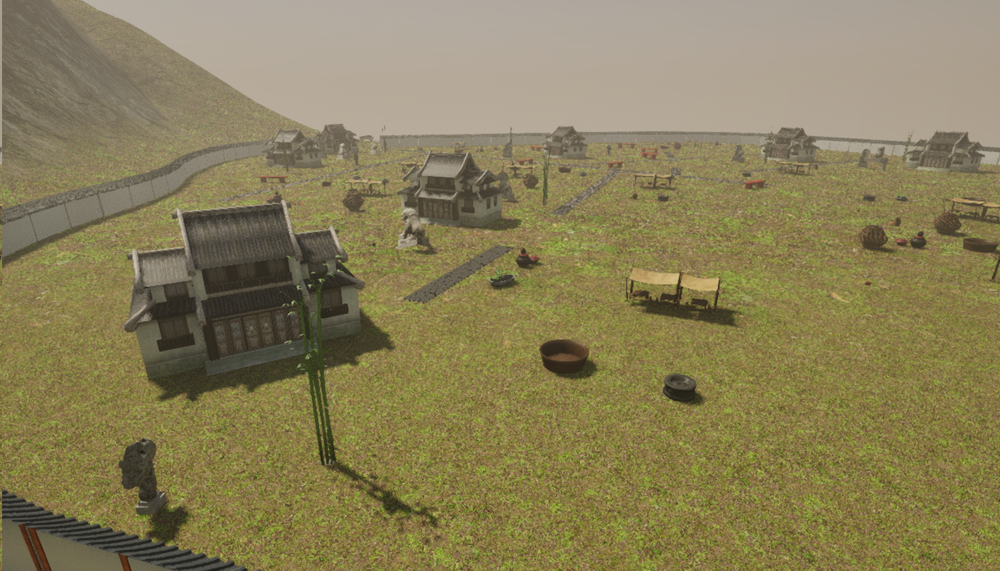

# Seele Scatter Regions for Unreal Engine

Seele Scatter Regions is an Unreal Engine plugin for generating non-grid,
scatter-style regions such as villages, farms, and cemeteries. It is designed
as a counterpart to regular city generation workflows that use grid roads,
plots, and aligned building blocks.



Example output from a Jiangnan-style sample recipe using project-provided
meshes and materials.

The plugin ships source code only. It does not include meshes, materials, or
sample content packs. Bring your own Static Mesh assets and assign them to a
`ScatterRegionRecipeDataAsset`.

Want to try Seele's Unreal scene generation workflow? Visit
[seeles.ai/features/create/unreal-game](https://www.seeles.ai/features/create/unreal-game).

## Requirements

- Unreal Engine 5.5
- A C++ Unreal project
- Static Mesh assets for the region recipes you want to generate

## Install

Clone the repository into your Unreal project plugins folder:

```powershell
cd <YourUnrealProject>\Plugins
git clone https://github.com/SeeleAI/seele-scatter-regions.git SeeleScatterRegions
```

Open the Unreal project, enable **Seele Scatter Regions**, regenerate project
files if prompted, and compile the project.

## Basic Use

1. Create a `ScatterRegionRecipeDataAsset`.
2. Set the region type to `Village`, `Farm`, or `Cemetery`.
3. Assign Static Mesh assets to the generated slots.
4. Call the editor subsystem, C++ generator, or JSON adapter.
5. Check the returned actor name, instance count, projection hits, warnings,
   and errors before treating the generated region as usable.

See [Docs/quickstart.md](Docs/quickstart.md) for a complete walkthrough.

## Public API

- `UScatterRegionRecipeDataAsset`: editable recipe asset.
- `FScatterRegionGenerator`: editor-side generator.
- `UScatterRegionEditorSubsystem`: editor subsystem wrapper.
- `FScatterRegionJsonAdapter`: JSON automation adapter.

## Repository Scope

This repository intentionally excludes generated build output, private
automation tools, and unreleased content assets. The plugin expects projects to
provide their own meshes and recipe assets.
